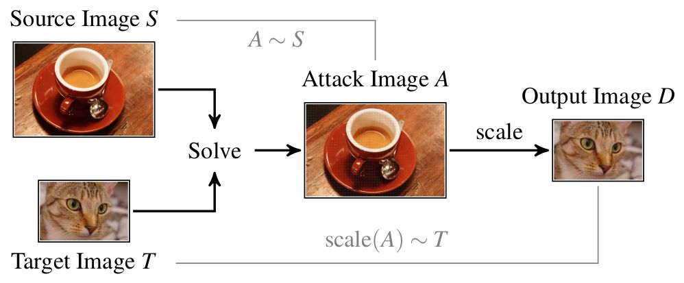

# Image-Scaling Attacks & Defenses

This repository belongs to our publication:

---

Erwin Quiring, David Klein, Daniel Arp, Martin Johns and Konrad Rieck.
Adversarial Preprocessing: Understanding and Preventing Image-Scaling Attacks in Machine Learning.
*Proc. of USENIX Security Symposium*, 2020.

---

## Background
For an introduction together with current works on this topic, please visit
our [website](http://scaling-attacks.net).

In short, image-scaling attacks enable an adversary to manipulate images, such
that they change their appearance/content after downscaling. In
particular, the attack generates an image A by slightly
perturbing the source image S, such that its scaled version D
matches a target image T. This process is illustrated in the figure above.

## Getting Started
This repository contains the main code for the attacks and defenses. It has a
simple API and can be easily used for own projects. The whole project consists
of python code, so that it should take only a few minutes to set up all
requirements with pip.

- Check the [README](./scaleatt/README.md) for a detailed introduction how to
set up the project.
- Check the directory *scaleatt/tutorial/* for a detailed tutorial how to
run attacks and defenses. The API is very simple, so do not hesitate to start.
